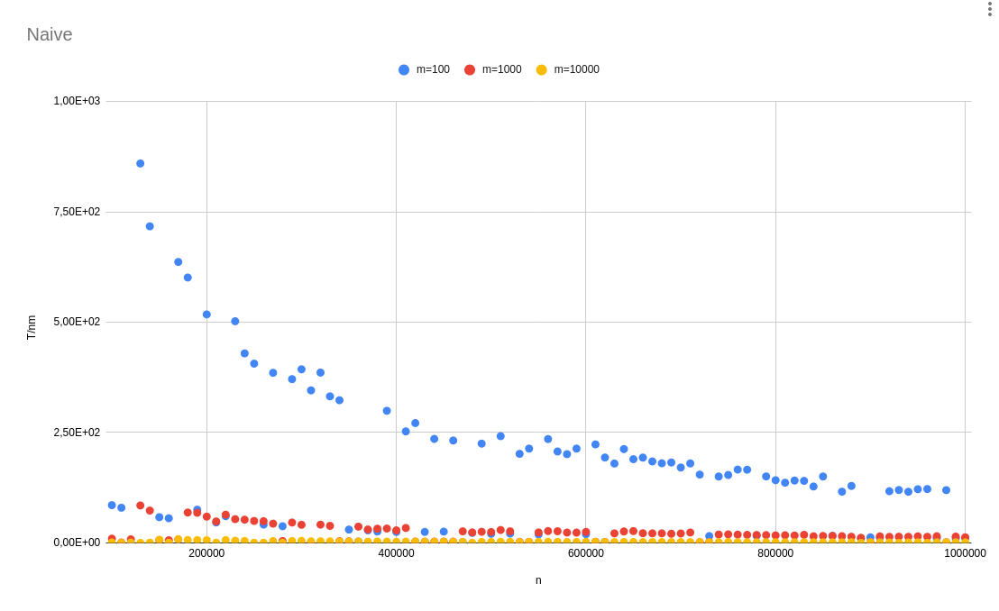
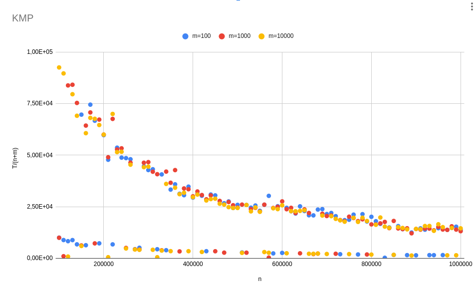

[](https://classroom.github.com/online_ide?assignment_repo_id=8599573&assignment_repo_type=AssignmentRepo)

# Basic exact pattern matching

This project is about exact pattern matching. You should implement the naive quadratic time algorithm and a linear time algorithm of your cheice, e.g. the border-array or the KMP-algorithm. The naive algorithm has the worst-case running time O(nm) and the other algorithms we have seen have worst-case running time O(n+m).

The algorithms should be implemented in two programs, `naive` and `lin`. Both programs should take two arguments (no more and no less): the first should be a Simple-FASTA file and the second a Simple-FASTQ file. The programs should output all matches in the Simple-SAM format to stdout (i.e., they should write to the terminal). Since we are only doing exact matching, the CIGAR strings in the output should consist of M’s only, since all the characters in the read will match the reference at the reported position.

For example, with this Simple-FASTA file

```
> chr1
mississippi
> chr2
mississippimississippi
```

and this Simple-FASTQ file

```
@read1
iss
@read2
mis
@read3
ssi
@read4
ssippi
```

your output should be

```
read1	chr1	2	3M	iss
read1	chr1	5	3M	iss
read1	chr2	2	3M	iss
read1	chr2	5	3M	iss
read1	chr2	13	3M	iss
read1	chr2	16	3M	iss
read2	chr1	1	3M	mis
read2	chr2	1	3M	mis
read2	chr2	12	3M	mis
read3	chr1	3	3M	ssi
read3	chr1	6	3M	ssi
read3	chr2	3	3M	ssi
read3	chr2	6	3M	ssi
read3	chr2	14	3M	ssi
read3	chr2	17	3M	ssi
read4	chr1	6	6M	ssippi
read4	chr2	6	6M	ssippi
read4	chr2	17	6M	ssippi
```

assuming you iterate over reads in an outer loop and FASTA records in an inner loop. If you order your loops differently, of course, the output will be different.

The project should be in groups of 2–3 students. It will not be graded.

## Part 1: parsers

Write parsers for Simple-FASTA and Simple-FASTQ if you have not done so already.

## Part 2: simulating data for evaluation

For testing the running time as functions of n and m, you should also write code for generating Simple-FASTA and Simple-FASTQ files (with appropriate properties for your tests).

## Part 2: mappers

Now write the tools for exact pattern matching. You can use the naive algorithm to test your linear time algorithm; the result of the two programs that you write should be identical after you sort the output.> ./naive fasta.fa fastq.fq | sort > naive.sam

```sh
> ./lin fasta.fa fastq.fq | sort > lin.sam
> diff naive.sam lin.sam
```

You might not have to sort the output, if you run through reads

## Evaluation

Implement the two algorithms in two tools, `naive` and `lin`, that must be present at the root of the repository once they are built. The test setup checks that they give the correct output on selected data, but you should still carefully test them.

Once you have implemented the tools, fill out the report below.

## Report

### Insights you may have had while implementing and comparing the algorithms.

There are many ways to archive the same thing but not every method is equally elegant.

### Problems encountered if any.

* Plotting resonable data can be very hard. Mainly making the plots readable so a conclusion can be made from them is difficult.
* Indices can also be difficult.

### Experiments that verifies the correctness of your implementations.

We have made testing with some examples were we knew the correct answer and checked that the algorithm gave the same answer as we expected.

After being confident in that the naive algorithm as correct we also ran alot of examples with randomly generated data and compared the output given by different algorithms to make sure they all gave the same answer to the same input.

### Experiments validating the running time.

For this section, you should address the following:

* An experiment that verifies that your implementation of `naive` uses no more time than O(nm) to find all occurrences of a given pattern in a text. Remember to explain your choice of test data. What are “best” and “worst” case inputs?
* We chose to use random data for testing the run-time. Since it is the best approximation of real data. This of course will most likely not give a worst case or best case example to run on. But running a lot of iterations it should all average out. For each seqence length we run 100 seqences of that length with a pattern length of m=100, 1000, 10000 for each of the algorithms. For every unique seqence we take the average time of running the algorithm with the same input 5 times.
* **Best case** for the naive algorithm is when the pattern you are trying to match has a first letter that does not match any letter in the string you are matching in. An example would be x="abababab", p="cab"
* **Worst case** for the naive algorithm would be that every letter in both the pattern and the matching string is the same. So you have to compare the whole pattern each time. An example would be x=b^n , p=b^m
* An experiment that verifies that your implementations of `lin` use no more time than O(n+m) to find all occurrences of a given pattern in a text. Remember to explain your choice of test data. What are “best” and “worst” case inputs?
* **Best case** is the same as for the naive you have a missmatch on the first letter on the pattern each time. This will move the letter you compare in x one forward each time looking at each letter in x one time and only the first letter in the pattern. An example would be x="abababab", p="cab".
* **Worst case** is that both x and the pattern being read the whole way through. If we have a missmatch at some point in the pattern borders will ensure the amount of letters that we have to read again the in the pattern is the amount that we skip in x. This means that the length of x and the length of the pattern will only get read once. An example would be x="aabaabaab", p="aaa"

You can insert pictures here like this:

```

```

 

 

I am not ready to share my own results yet, so I will just show you a fast scooter.


